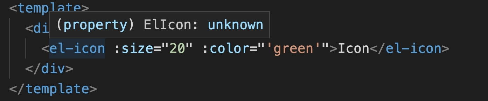

## Icon组件的实现

### 目录结构确定

所有组件的都按照下面的结构划分

~~~bash
├── packages
│   ├── components
│   │   ├── icon
│   │   │   ├── __tests__       # 测试目录
│   │   │   ├── src             # 组件入口目录
│   │   │   │   ├── icon.ts     # 组件属性与 TS 类型
│   │   │   │   └── icon.vue    # 组件模板内容
│   │   │   ├── style           # 组件样式目录
│   │   │   └── index.ts        # 组件入口文件
│   │   └── package.json
~~~

`icon.ts` 和 `icon.vue`抽离，是因为vue3 `Composition API` 的优势。可以把组件的属性和TS类型抽离放在一个独立的文件夹，方便后期维护。

Vue2 没有 Composition API 之前 Vue 相关业务的代码需要配置到 Option 的特定的区域，导致代码可复用性不高

### 定义组件属性 Prop

Element Plus的Icon组件只有两个Prop属性：
+ `color`：svg的填充色
+ `size`: svg图标大小

我们希望父组件传递给子组件的prop的类型是符合要求的，可以采用vue提供的prop验证机制：

验证的类型（type）可以是下列原生构造函数中的一个：
+ String
+ Number
+ Boolean
+ Array
+ Object
+ Date
+ Function
+ Symbool

~~~ts
export const iconProps = {
  color: String,
  size: [Number, String], // size 可以是数字，也可以是字符串
} as const

// 实际上推断出来是下面的类型：why？
// const iconProps: {
//   readonly color: StringConstructor;
//   readonly size: readonly [NumberConstructor, StringConstructor];
// }
~~~

`as const` 是 TS 的语法，它告诉 TS 它所断言的值以及该值的所有层级的子属性都是不可篡改的。

TS中类型有两种`静态类型`和`实例类型`。`String` 只是一个构造函数，并不是 TypeScript 中的 `string` 类型，String 构造函数在 TypeScript 的类型是它的构造函数类型： `StringConstructor` ，但这并不是我们需要的，我们希望 String 构造函数返回的是字符串类型 `string`。

~~~ts
import type { ExtractPropTypes, PropType } from 'vue'

export const iconProps = {
  color: String,
  size: [Number, String] as PropType<number | string>,
} as const

export type Props = ExtractPropTypes<typeof iconProps>
~~~

Vue3提供了自带的Props类型声明: `ExtractPropTypes`，可以接受一个类型，把对应的所接收的 props 类型返回出来，同时如果是构造函数类型则转换成对应的类型，比如 StringConstructor 转换成 string。

~~~TS
const propsOptions = {
  foo: String,
  bar: Boolean,
  baz: {
    type: Number,
    required: true
  },
  qux: {
    type: Number,
    default: 1
  }
} as const

type Props = ExtractPropTypes<typeof propsOptions>
// {
//   foo?: string,
//   bar: boolean,
//   baz: number,
//   qux: number
// }
~~~

`PropType`用于在用运行时 `props` 声明时给一个 `prop` 标注更**复杂**的类型定义，因为验证类型只能是构造函数中的几个:

~~~ts
interface Book {
  title: string
  author: string
  year: number
}

export default {
  props: {
    book: {
      // 提供一个比 `Object` 更具体的类型
      type: Object as PropType<Book>,
      required: true
    }
  }
}
~~~

最后我们还需要把 SFC 的 icon.vue 文件的实例类型返回出去：
~~~ts
import type Icon from './icon.vue'
export type IconInstance = InstanceType<typeof Icon>
~~~

TypeScript 中的 `InstanceType` 函数：该函数返回（构造） 由某个构造函数构造出来的实例类型组成的类型

### 设置CSS变量

声明CSS变量的时候，变量名前面要加两根连词线（`--`），例如上文的颜色变量：`--color`。为什么选择两根连词线（--）表示变量？因为 `$` 被 `Sass` 用掉了，`@`被 `Less` 用掉了。为了不产生冲突，官方的 CSS 变量就改用两根连词线了。

在 Vue 中可以通过在行内的 `style` 属性中定义 CSS 变量，然后就可以通过 Vue 的动态变量控制 CSS 变量，再在 style 标签中使用行内定义好的 CSS 变量。使用 CSS 变量可以通过 `var` 关键进行获取定义的 CSS 变量，例如：`var(--color)`。

~~~vue
<template>
	

       <i class="el-icon" :style="{'--color': color}" />
    

</template>
~~~

### script setup 编写SFC组件

通过script setup 方式编写的 SFC 组件，导入刚刚写好的Props，要使用`defineProps`来声明props，声明的props也会自动暴露给模板，`defineProps` 会返回一个对象，其中包含了可以传递给组件的所有 props。

~~~ts
const props = defineProps(iconProps)

const style = computed<CSSProperties>(() => {
  if (!props.size && !props.color) return {}

  return {
    fontSize: isUndefined(props.size) ? undefined : addUnit(props.size),
    '--color': props.color,
  }
})
~~~

`v-bind="$attrs"`表示将父组件传递给子组件的所有属性都动态绑定到当前组件的属性上。`$attrs`是一个特殊的属性，它包含了父组件传递给子组件的非props属性。

### 组件注册

#### 局部注册

去到 play 目录下的 src 目录中的 App.vue 文件中把上面写的 Icon 组件进行引入测试，两种方式局部注册：
1. script setup直接import就可以使用
2. defineComponent 定义组件，需要再components中写上

#### 全局注册

Vue3组件库的实现原理：每一个组件安装一个插件，通过插件完成组件的全局注册。

需要给每一个组件都添加一个 `install` 方法，我们可以把这个方法进行封装成为一个公共方法。我们在 `packages/utils/vue/install.ts` 中添加以下代码：

~~~ts
import type { Plugin } from 'vue'
// 通过 Vue 提供的 Plugin 类型和传进来的组件类型 T 的集合进行确定我们的组件类型具有 Plugin 类型方法，如 install 方法
export type SFCWithInstall<T> = T & Plugin
export const withInstall = <T>(comp: T) => {
  ;(comp as SFCWithInstall<T>).install = function (app) {
    // 组件的注册名称参数暂时是写死了 ElIcon，在后面的小节，我们再详细说明如何进行设置动态组件名称
    app.component('ElIcon', comp as SFCWithInstall<T>)
  }
  return comp as SFCWithInstall<T>
}
~~~

`SFCWithInstall<T>`，返回一个交叉类型: 同时具有组件的类型和Plugin类型
`withInstall` 函数接受一个组件类型 T 作为参数，并返回一个具有 `install` 方法的组件类型 comp。在 `install` 方法中，组件被注册为全局组件，注册名称为 'ElIcon'。

`packages/components/icon/index.ts` 中的代码为：
~~~ts
import { withInstall } from '@msk/utils'
import Icon from './src/icon.vue'
// 通过 withInstall 方法给 Icon 添加了一个 install 方法
const ElIcon = withInstall(Icon)
export default ElIcon
// 导出 Icon 组件的 props
export * from './src/icon'
~~~

接下来，在 `play/main.ts` 中进行全局安装引入 `Icon` 组件。

~~~ts
// 组件库
const components = [ElIcon]
// 是否已安装标识
const INSTALLED_KEY = Symbol('INSTALLED_KEY')
// 组件库插件
const ElementPlus = {
  install(app: any) {
    // 如果该组件库已经安装过了，则不进行安装
    if (app[INSTALLED_KEY]) return
    // 将标识值设置为 true，表示已经安装了
    app[INSTALLED_KEY] = true
    // 循环组件库中的每个组件进行安装
    components.forEach((c) => app.use(c))
  },
}

const app = createApp(App)
// 安装组件库
app.use(ElementPlus)
app.mount('#app')
~~~

运行项目，成功加载Icon组件

### 全局组件类型声明

vue3没有对自定义的全局组件做TS的类型处理支持，需要手动开启`TS`的**增强类型系统**，声明`*d.ts`类型文件，使用声明文件对类型接口进行类型模块扩充并导出。

`Vue3 SFC` 文件的智能提示是 `Volar` 提供的， 其实在 `Volar` 的 `README.md` 文件中就有相关的提示：`Define Global Components`

在根目录的 `typings` 文件夹下新建一个 `components.d.ts` 文件进行以下代码的实现：

`*.d.ts`对于typescript而言，是类型声明文件，且在`*.d.ts`文件中的顶级声明必须以`declare`或`export`修饰符开头。同时在项目编译过后，`*.d.ts`文件是不会生成任何代码的。

~~~ts
import type Icon from '@msk/components/icon'
// For this project development
import '@vue/runtime-core'

// 用`declare module`语法声明了一个模块，指定了模块的路径`'*.vue'`，表示所有的`.vue`文件都可以在该模块内使用。
declare module '@vue/runtime-core' {
  // GlobalComponents for Volar
  export interface GlobalComponents {
    ElIcon: typeof Icon
  }
}

export {}
~~~

通过上述设置我们的通过全局注册的 Icon 组件便有类型提示了。

### script setup 组件的名称设置

前面在全局注册组件时，组件名称写死，但我们需要动态注册组件名称。

vue3的`defineComponent`可以设置组件的`name`，但是script setup并没有提供设置组件名称的API，采用`unplugin-vue-define-options`插件实现：

在 `
~~~

最后可以在install.ts中解构出name属性，动态设置组件名称了：

~~~ts
import type { Plugin } from 'vue'
// 通过 Vue 提供的 Plugin 类型和传进来的组件类型 T 的集合进行确定我们的组件类型具有 Plugin 类型方法，如 install 方法
export type SFCWithInstall<T> = T & Plugin
export const withInstall = <T>(comp: T) => {
  ;(comp as SFCWithInstall<T>).install = function (app) {
    // 动态设置组件的名称
    const { name } = comp as unknown as { name: string }
    app.component(name, comp as SFCWithInstall<T>)
  }
  return comp as SFCWithInstall<T>
}
~~~

### Icon中的图标

#### SVG图标

Icon 中的图标有两种方式实现，其中一种是通过 SVG 图片，而通过 SVG 图片的实现方式本质就是实现一个 SVG 的组件。

template内容就是svg图片的源码：

~~~vue
<template>
  <svg
    viewBox="0 0 1024 1024"
    xmlns="http://www.w3.org/2000/svg"
    data-v-029747aa=""
  >
    <path
      fill="currentColor"
      d="M832 512a32 32 0 1 1 64 0v352a32 32 0 0 1-32 32H160a32 32 0 0 1-32-32V160a32 32 0 0 1 32-32h352a32 32 0 0 1 0 64H192v640h640V512z"
    />
    <path
      fill="currentColor"
      d="m469.952 554.24 52.8-7.552L847.104 222.4a32 32 0 1 0-45.248-45.248L477.44 501.44l-7.552 52.8zm422.4-422.4a96 96 0 0 1 0 135.808l-331.84 331.84a32 32 0 0 1-18.112 9.088L436.8 623.68a32 32 0 0 1-36.224-36.224l15.104-105.6a32 32 0 0 1 9.024-18.112l331.904-331.84a96 96 0 0 1 135.744 0z"
    />
  </svg>
</template>

~~~

### 总结

+ 定义组件Prop（单向流只读），实现父组件向子组件传递属性
+ 在vue组件中使用css变量，`var`关键字获取，声明变量前加`--`
+ 全局注册组件，使用 defineOptions 宏，设置name属性（在 script setup中）
+ components.d.ts中利用volar插件支持自定义组件类型
+ SVG图标实现