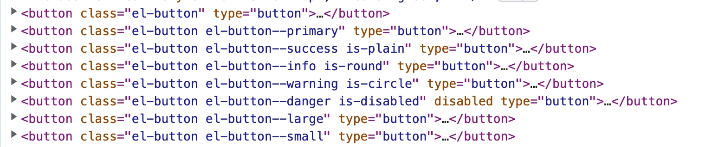

## Button组件实现流程

button组件是基于HTML原生的`<button>`标签实现的，前后端未分离时代，button经常和表单一起使用，组件库将按照分离特性重新封装button组件。

button 标签，超链接 a 标签，input 标签等原生可以通过鼠标进行交互的标签，也都可以通过键盘进行交互。在封装现代的组件当中我们同样要保留这些优势。所以即便可以通过其他标签和原生 JavaScript 实现按钮的相关的功能，但我们依然使用 button 原生标签进行封装

### 原生button 特性

#### 表单提交/重置 submit / reset

~~~html
<form>
  <input type="text" name="username" />
  <button type="reset">重置</button>
  <button type="submit">提交</button>
</form>
~~~

填完相关信息，点击提交按钮之后，在地址栏和网络请求中都出现了我们填写的相关信息，这其实是 form 表单的默认提交方式 GET 请求的表现形式，当然还可以设置其他提交方式，比如 POST 方式，在前后端不分离时代，就是这样提交表单信息的。

重置表单的时候，如果字段的初始值为空，则恢复为空，如果字段有默认值，则恢复为默认值。

#### disabled

HTML 中的 input 标签、button 标签、option 标签等表单标签都具有一个 disabled 属性。当赋予该属性时该标签将变得不可交互。

### 基础button实现流程

创建button的目录：
~~~bash
├── packages
│   ├── components
│   │   ├── button
│   │   │   ├── __tests__       # 测试目录
│   │   │   ├── src             # 组件入口目录
│   │   │   │   ├── button.ts     # 组件属性与 TS 类型
│   │   │   │   └── button.vue    # 组件模板内容
│   │   │   ├── style           # 组件样式目录
│   │   │   └── index.ts        # 组件入口文件
│   │   └── package.json
~~~

1. 首先在基础版本 Button 组件中实现原生button具有的功能：submit，reset，autofocus，disabled。
2. 使用  type、plain、round  和  circle  来定义按钮的样式，这部分功能，我们也在基础部分实现，以及组件大小。

~~~ts
import type { ExtractPropTypes, PropType } from 'vue'
import type Button from './button.vue'

// 点击事件
export const buttonEmits = {
  click: (evt: MouseEvent) => evt instanceof MouseEvent,
}

export type ButtonEmits = typeof buttonEmits
// 使用 type 来定义按钮的样式
export type ButtonType =
  | ''
  | 'default'
  | 'primary'
  | 'success'
  | 'warning'
  | 'info'
  | 'danger'
  | 'text'
// type 原始类型
export type ButtonNativeType = 'button' | 'submit' | 'reset'
// size 组件大小
export type ButtonSize = '' | 'default' | 'small' | 'large'
// 定义 props
export const buttonProps = {
  size: String as PropType<ButtonSize>,
  type: {
    type: String as PropType<ButtonType>,
  },
  nativeType: {
    type: String as PropType<ButtonNativeType>,
    default: 'button',
  },
  disabled: Boolean,
  autofocus: Boolean,
  round: Boolean,
  plain: Boolean,
  circle: Boolean,
} as const
// Props 类型
export type ButtonProps = ExtractPropTypes<typeof buttonProps>
// Button 组件实例类型
export type ButtonInstance = InstanceType<typeof Button>
~~~

vue3提供的类型函数作用：
+ `PropType`：用于在用运行时 props 声明时给一个 prop 标注更复杂的类型定义。因为vue提供的prop验证类型只能是原生构造函数类型的一种，可以对我们提供的更具体的类型做一个转化
+ `ExtractPropTypes`：提取面向外部的 props类型，将构造函数类型`StringConstructor`转化为`string`
+ `InstanceType`：获取vue组件的实例对象类型

定义vue文件的基础代码：

~~~vue
<template>
  <button
    ref="_ref"
    :class="[
      ns.b(),
      ns.m(type),
      ns.m(size),
      ns.is('disabled', disabled),
      ns.is('plain', plain),
      ns.is('round', round),
      ns.is('circle', circle),
    ]"
    :disabled="disabled"
    :autofocus="autofocus"
    :type="nativeType"
    @click="handleClick"
  >
    <slot />
  </button>
</template>

~~~

最后在入口文件，定义Button组件的内容:

~~~ts
import { withInstall } from '@msk/utils'
import Button from './src/button.vue'
// 通过 withInstall 方法给 Icon 添加了一个 install 方法
const ElButton = withInstall(Button)
// 可以通过 app.use 来使用，也可以通过 import 方式单独使用
export default ElButton
// 导出 button 组件的 props
export * from './src/button'
~~~

### vue3的编译宏方法

运用于`script setup`中

#### defineProps、withDefaults

~~~vue

~~~

+ 通过`defineProps`，组件的使用者在外部传递 props，然后组件内部就可以根据这些 props 实现各种各样的功能了。
+ 这种方式跟使用 option 方式编写组件时定义 props 的方式很像，如果想要支持 TypeScript 类型验证，那需要借助 Vue3 中提供的 PropType。
+ `withDefults`可以添加Props的默认值
+ `defineProps` 只能在 `script setup` 中使用
+ 可以通过 TypeScript 的专有声明进行声明 props：`defineProps<Props>()`

~~~vue

~~~

#### defineEmits

Vue3中子组件向父组件传递自定义事件要通过`emit`：

~~~vue

~~~

在 script setup 模式则需要通过 `defineEmits` 这个编译宏 API 来进行声明

~~~vue
<template>
	<button @click="handleClick">按钮</button>
</template>

~~~

+ defineEmits也可以接受一个数组 `const emit = defineEmits(['handle'])`
+ 跟 defineProps 一样，还可以使用 TypeScript 专有的声明方式进行声明。`const emit = defineEmits<{(e: 'handle', evt: MouseEvent): void}>()`
+ 只能在 script setup 中使用，不需要显式导入即可使用
+ 必须在 script setup 的顶层使用，不可以在 script setup 的局部作用域中使用。

#### defineExpose

如果要让父组件访问子组件中的变量和方法，则需要在 setup 方法中将需要访问的变量和方法返回出去即可。这也是父子组件通讯方式的一种。

不使用script setup，就直接return出去

### 测试组件

在 play 项目中引用我们编写好的 Button 组件进行测试。在main.ts中添加:

~~~ts
import ElButton from '@msk/components/button'
// 组件库
const components = [ElIcon, ElButton]
~~~

接着我们对我们前面写的基础功能进行测试，测试代码如下：
~~~html
<el-button>按钮</el-button>
<el-button type="primary">Primary</el-button>
<el-button type="success" plain>Success</el-button>
<el-button type="info" round>Info</el-button>
<el-button type="warning" circle>Warning</el-button>
<el-button type="danger" disabled>Danger</el-button>
<el-button size="large">按钮</el-button>
<el-button size="small">按钮</el-button>
~~~

成功渲染：

回顾使用JS实现BEM规范命名的class：
+ `const ns = useNamespace('button')` 通过字符串参数 'button' 表明这个模块的 classname 的开头是 `el-button`
+ `ns.b()` 则表明没有前缀将生成 `el-button` classname。如果有前缀，例如 `ns.b('item')` 那么将生成 `el-button-item`。
+ `ns.m()` 则是根据参数创建块前缀修改器，例如 `ns.m('primary')` 将会生成 `el-button--primary`。
+ `ns.is()` 则是根据参数创建动作状态的 classname，例如 `ns.is('disabled', disabled)`，如果第二个参数 `disabled` 为真则创建 `is_disabled` ，如果为假则什么也不创建。

具体classname对应的css后期再实现。